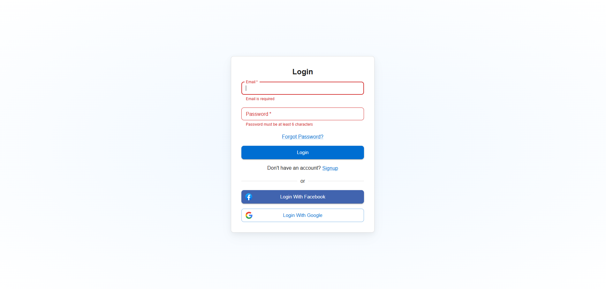
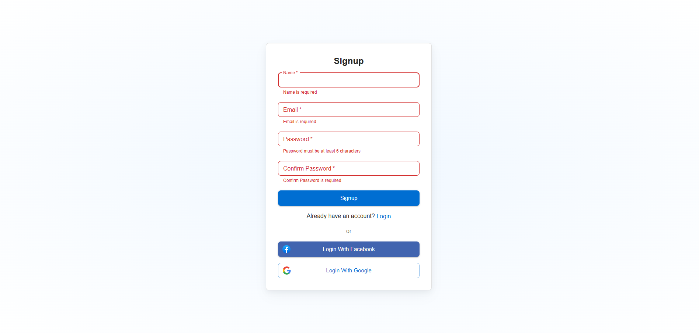
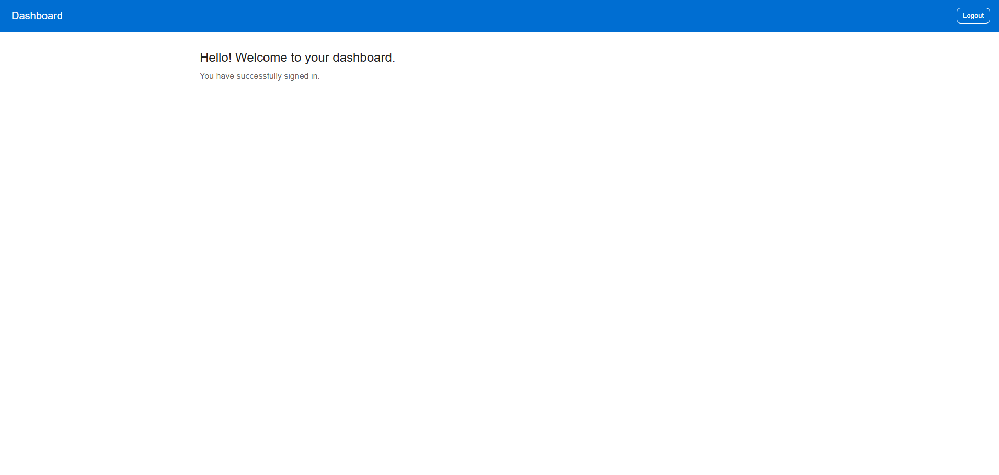

# React Js Assessment

A fully responsive and validated sign-up/login system built with React, TypeScript, and Material UI. The app includes local user storage, real-time form validation, and smooth navigation using React Router.

🚀 Live Demo
🔗 View Live App

📂 GitHub Repository
🔗 View on GitHub

✨ Features
🔐 Email & password authentication

✅ React Hook Form + Yup validation with strict types

💾 LocalStorage API to store users securely (base64-encoded passwords)

📋 Form validation with error messages

🔁 Routing between Sign Up, Login, and Dashboard using react-router-dom

🎨 Custom Material UI Theme:

Primary color: #006ed2

Secondary color: #4164af

Required asterisk colored red

Buttons start with capitalized text

📦 Snackbar Alerts for error and success messages

🔓 Logout Functionality

🧠 Clean code, human-friendly layout, accessible design

🧪 Tech Stack
Tool / Library	Purpose
React + TypeScript	Frontend framework & static typing
Material UI (MUI)	UI components and theming
React Hook Form	Form management
Yup	Schema validation
React Router DOM	Page navigation and routing

📷 Screenshots
## 📸 Demo Screenshots

### 🔐 Login Page


### 📝 Signup Page


### 📊 Dashboard


```bash
Copy
Edit
# 1. Clone the repo
git clone https://github.com/your-username/react-auth-app
cd react-auth-app

# 2. Install dependencies
npm install

# 3. Run locally
npm run dev
The app will start on http://localhost:5173 (or similar, if using Vite)

🧼 Folder Structure

src/
├── components/
│   └── CustomIcons.tsx
├── pages/
│   ├── SignUpPage.tsx
│   ├── LogInPage.tsx
│   └── DashboardPage.tsx
├── theme.ts
├── App.tsx
└── main.tsx
```


# Author
Tamilarasan Elumalai

Frontend Developer — React, TypeScript, Next.js
💼 LinkedIn | 🌐 Portfolio